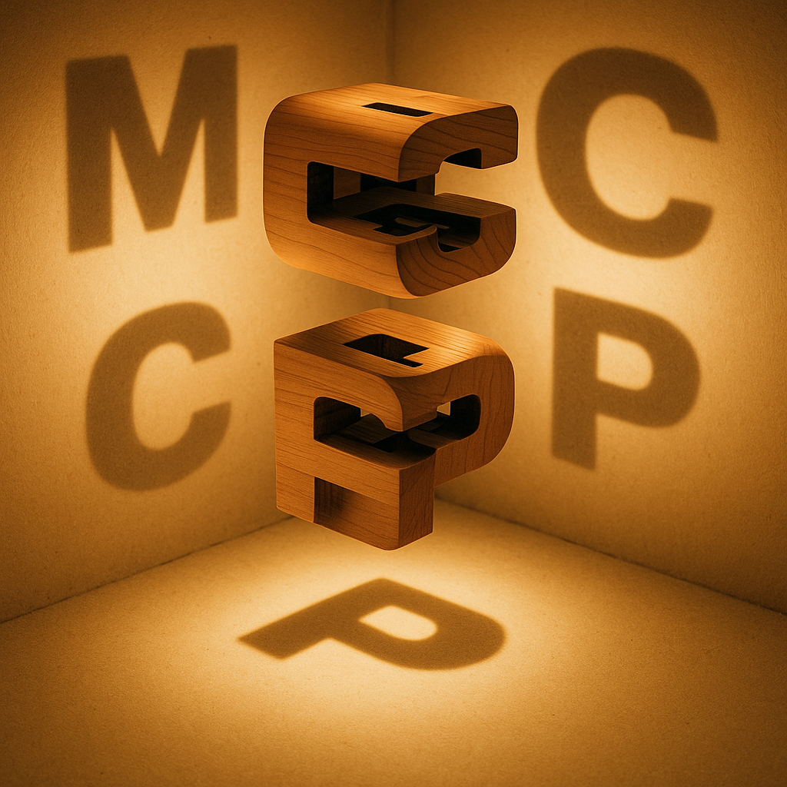

# PowerShell MCP - PSMCP

<p align="center">
    
</p>

## Getting Started with MCP

```
Install-Module PSMCP 

New-MCP d:\temp\testMCP
code-insiders d:\temp\testMCP
```

https://json-schema.org/specification

## Use APIs as tools for your Agents with MCP

i like the multi server mcp json they have

- https://www.youtube.com/watch?v=Xf5xxhT9ySs


## Create a Custom MCP that Calls Cursor Tools
- https://egghead.io/create-a-custom-mcp-that-calls-cursor-tools~r77sw

## Build Your First MCP Tool in Cursor in Just 2 Minutes
- https://egghead.io/build-your-first-mcp-tool-in-cursor-in-just-2-minutes~i8kyo

## Swiss Army Knife for MCP Servers
https://github.com/f/mcptools

## Agentic Coding MCPs

https://gist.github.com/ruvnet/2e08d3ac9bf936fd867978aaa4f0d3c6