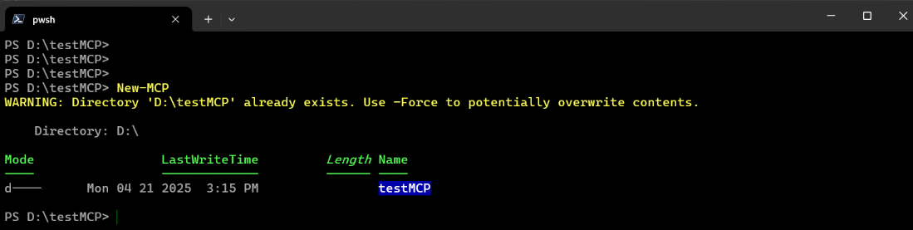
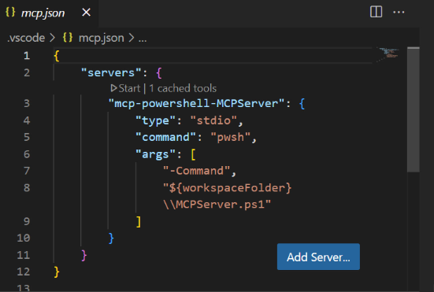
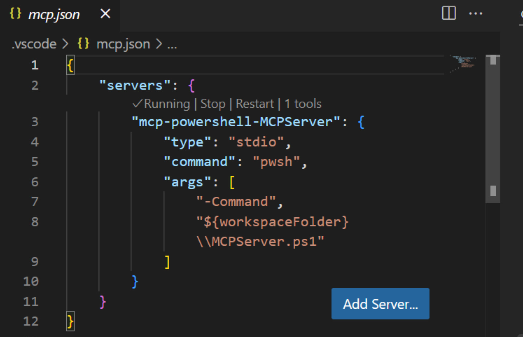
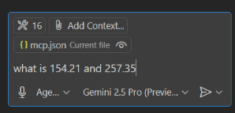
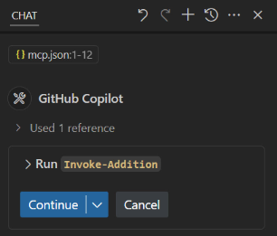
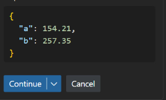
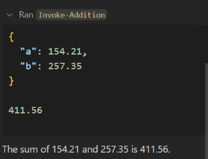

From script to service—no YAML, no friction. Just prompts, tools, and instant execution.
It’s not automation. It’s collaboration.

## New MCP

Start by creating a new MCP server with a simple command. This scaffolds the necessary files and sets the stage for dynamic AI interaction.

Once initialized, you're ready to configure your MCP tools—no YAML, no fuss.

## MCP JSON

The JSON file defines your available tools. In this example, we’re creating a simple Invoke-Addition function.

Clicking "Start" embeds the tool definition into the MCP config. Now it’s registered and ready to go.

## After Clicking Start
With the tool registered, starting the server wires up everything under the hood.

The server is hot and listening. Now you can talk to your code like it’s a teammate.

## Let's Prompt

Time to interact. Drop a natural language prompt and let the AI figure out which function to use.

Your intent is recognized—and the AI knows exactly what tool to invoke.

## Copilot Wants to Run your function

Copilot steps in, proposing to call your registered function based on your prompt.

Confirm to execute and let the AI orchestrate the rest.

## Expand the Run
Peek under the hood—see the actual arguments passed to your function.

Confirm to execute and let the AI orchestrate the rest.

## After Run
Execution complete. The function ran with your inputs, and now you get the result.

This isn’t just code—it’s a conversation. One prompt, one response, and a world of automation opens up.

🟨 Conclusion
This workflow redefines how we build and run tools. From scaffolding an MCP server to interacting with it using plain language, the line between prompt and program is disappearing.

No more brittle glue code. No more hand-rolling APIs. Just describe what you want, and your AI-enhanced PowerShell server takes it from there—registering, invoking, and summarizing functions on demand.

Welcome to the future of coding.
It’s not just execution—it’s collaboration.